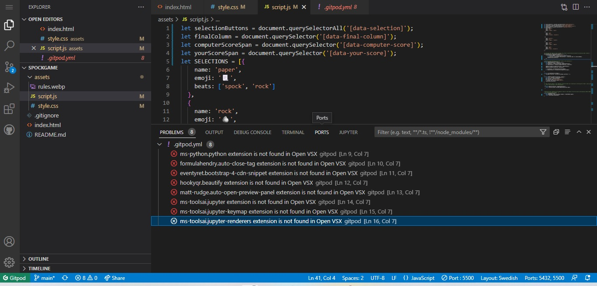

# Rock, Paper, Scissors, Lizard, Spock Game

Rock, Paper, Scissors, Lizard, Spock Game.  This games serves as a nice break to get your mind on something else when you stuck coding or just for laughs when you're boored.  

While the this is being a learning experience I tried to keep things as simpel as possible, not invent the wheel twice and make things more complicated than it has to be. Thats the beauty with Java Script that you can build amzing ting with simplistic lines of code. And I hope it come across in this project.

## Planning

Fisrt things fisrt. 

The wireframe used for the project were a very helpful resource. And writing  a TODO list.

## Features 

- __The Spock Game Selections Area__

  - Featured on top of the page and mmost notable for the user is the selections icons, which is actually buttons in form of emojis. If you is familiar with paper, rock and scissors you it is easy and understandable. If the user is not familiar with the rules of the Spock Game there is Rules link  placed just above. It opens in a seperate tab, and the font-color is not affected by visiting the rules page, for aesthetic reasons. 

  The beige background color is neutral and provides a good contrast for the elemnts displayd on the game page. 

- __The Results Area__

  - This section will allow the user to keep track of the score by viewing the past selection being renderd with a function that creates new divs wich is stacked in a column. To make it even more clear to the user the winner emoji is bieng enlarged and the loosers emoji is being darkend down with a lower opacity.

- __The Scores Area__

  - The scores area is just a span and a function that increment the scores by one and print it out in the document with the innerText method. I also included a emoji that represent the user and the computer. The player emoji is choossen with conideration of gender neutrality and inclusion.

### Features Left to Implement

- Sound effects
- Text bubbles

## Testing 

For testing google devtool is a great rescource. Specially using Lighthouse. 

also using the built in debugger in the IDE, only bugs found where the 8 ones that comes from CI-template.

### Validator Testing 

- HTML
    -4 errors were returned when passing through the official WC3 validator
    
- CSS
    - No errors were found when passing through the official Jigsaw validator
    
- JavaScript
    - No errors were found when passing through the official JSHint validator 
    

## Deployment

i had some issues with absolute filepaths (wich had been mentioned in the LMS), wich caused me to totally 
panic in the last minute deploying the project the first try. 

The live link can be found here - 

## Credits 

Credits be where credits due...

### Content 

When I started out I hade my wireframe to go by when scrolling youtube for inspiration. I came across Kyle's channel 
"Web Devs Simplyfied"
[Specific YouTube Tutorial](https://youtu.be/1yS-JV4fWqY)

His game design pretty much matched my wireframe and the way he made the result render on the screen. I aslo liked how his code looked.

the fonts is from google fonts:

https://fonts.google.com

### Media

- The photo for game rules comes from: 

https://www.instructables.com/How-to-Play-Rock-Paper-Scissors-Lizard-Spock/

- the emojis used in spock Game are from:

https://www.instructables.com/How-to-Play-Rock-Paper-Scissors-Lizard-Spock/

## Other Resources 

credits to stackoverflow.com